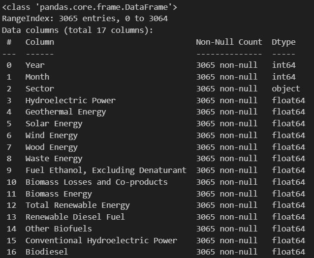
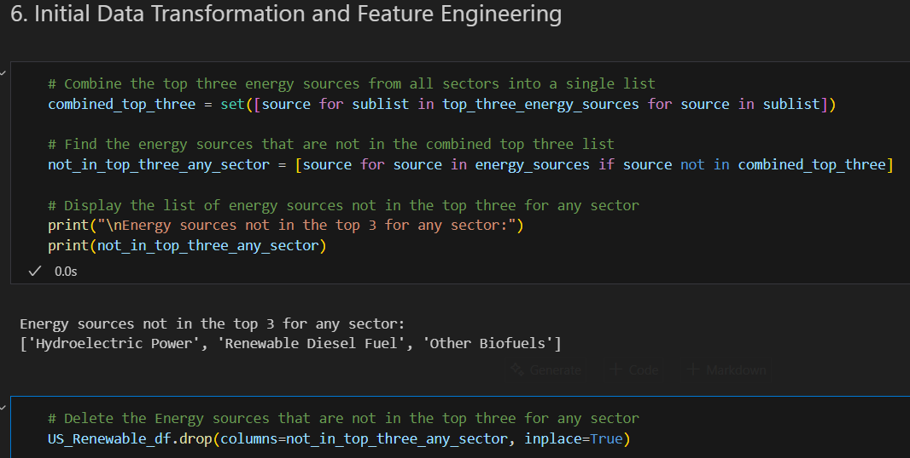
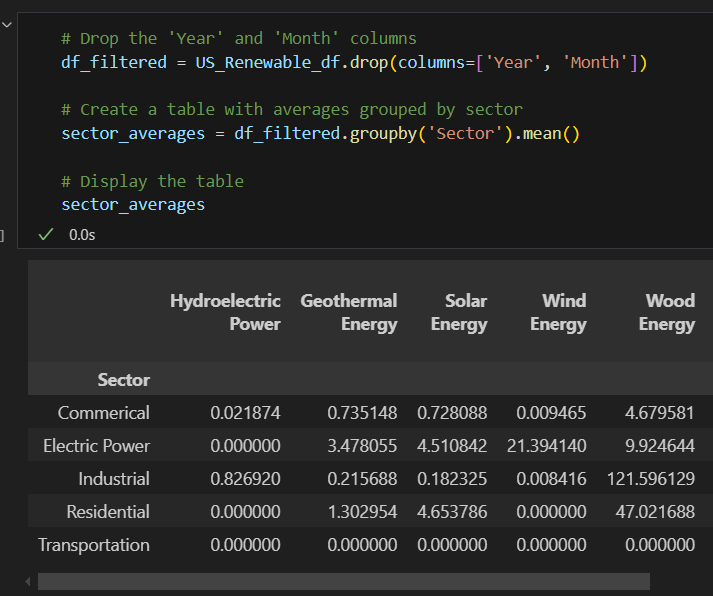
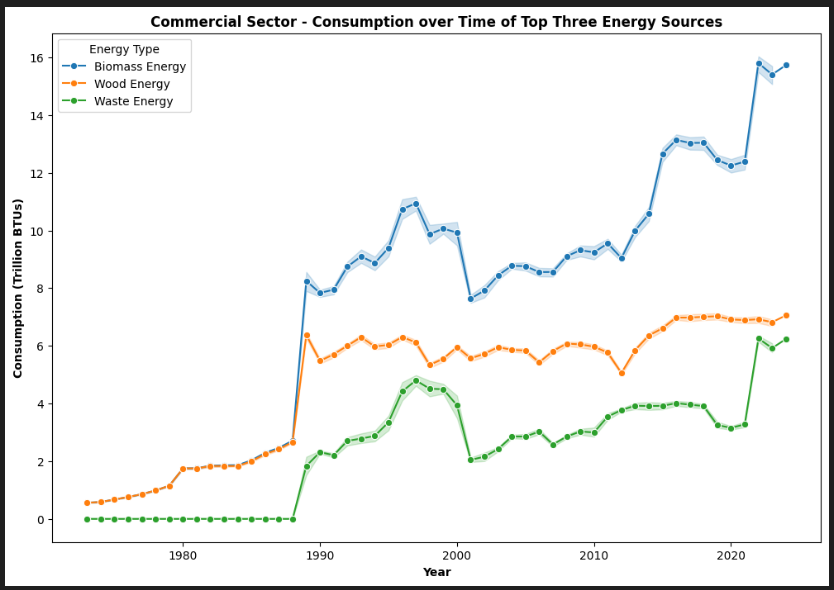

# **datafun-06-eda**

## **Description:**
Project 6 - EDA of U.S. Renewable Energy Consumption

This project involves performing exploratory data analysis on the U.S. Renewable Energy Consumption dataset. The goal is to uncover patterns and insights into the consumption of renewable energy sources across different sectors over time. By analyzing the data, I aim to understand the contributions of various energy sources to individual sectors in the United States.

---

## **Project Overview:**

**Data Exploration**:
    -Inspecting the shape and structure of the dataset
    - Calculating summary statistics for numerical columns to understand the distribution and central tendencies of the data.



**Data Cleaning**: 
   - Removing non-significant energy sources that are not in the top three for any sector to focus on the most impactful sources.
   - Correcting typographical errors in the dataset for consistency.



**Statistical Analysis**:
   - Grouping data by sector to calculate average consumption values for each energy source.



**Visualizations**:
   - Creating visualizations to illustrate the consumption patterns of the top three energy sources for each sector over time.
   - Using line plots and count plots to display trends and distributions.



**Summaries and Insights**:
   - Summarizing key findings and insights from the analysis.
   - Highlighting sector-specific major contributors and emerging trends in renewable energy consumption.

---

# **Dataset Description:**

The U.S. Renewable Energy Consumption csv contains monthly data on renewable energy consumption in the United States, spanning from January 1973 to December 2024. The data is categorized by energy source (such as solar, wind, hydroelectric, and biomass) and consumption sector (residential, commercial, industrial, and transportation). The source of this data is the U.S. Energy Information Administration (EIA).

[Access Data here:] (https://www.kaggle.com/datasets/alistairking/renewable-energy-consumption-in-the-u-s?resource=download)

---

# **How to run the project yourself:**

**Cloned and Opened my Github project**
```
cd \Projects
git clone https://github.com/dennykami1/datafun-06-eda
cd datafun-06-eda
code .
```

**Created a .gitignore file, and pasted in contents from example**
```
# Python virtual environment
.venv/

# Visual Studio Code settings and workspace
.vscode/

# Compiled Python files
__pycache__/

# macOS system files
.DS_Store

# Jupyter Notebook checkpoints
 .ipynb_checkpoints/
```

**Commited Changes to Github**
```
git add .
git commit -m "Add message"
git push -u origin main
```

**Created Virtual Environment and Activated**
```
py -m venv .venv
.venv\Scripts\activate
```

**Upgrade pip & install requirements.txt**
```
py -m pip install --upgrade pip setuptools wheel
py -m pip install -r requirements.txt
```